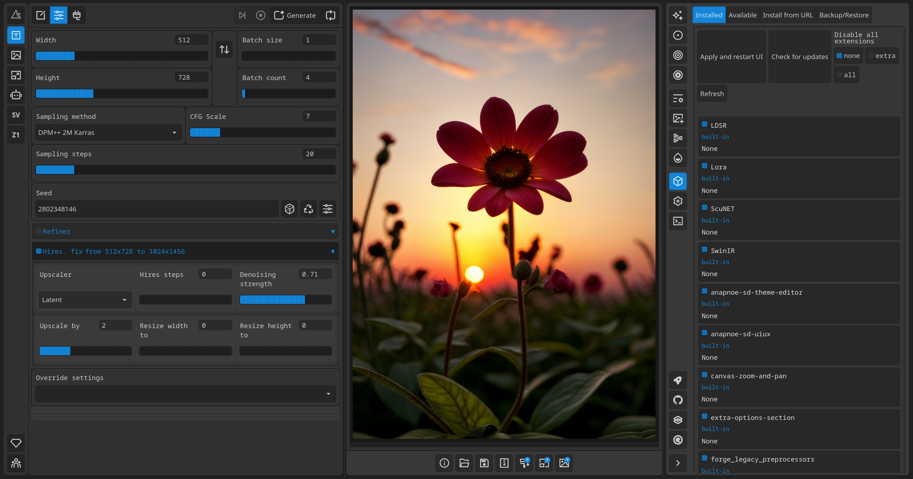
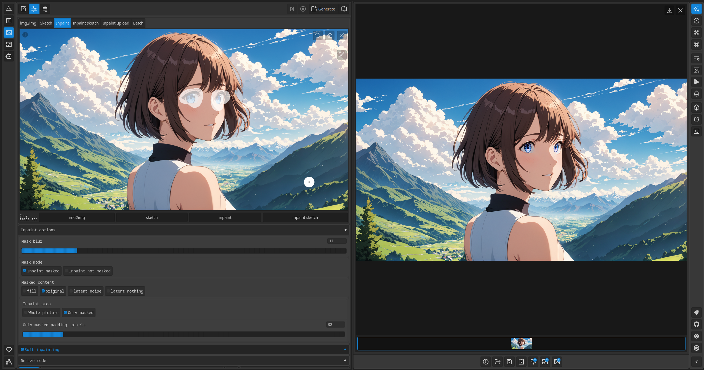

# UI-UX Forge Fusion
## Combining the aesthetic interface and user-centric design of the *UI-UX* fork with the unparalleled optimizations and speed of the *Forge* fork.

### A merge of the forks [stable-diffusion-webui-ux](https://github.com/anapnoe/stable-diffusion-webui-ux/assets/124302297/15db3c70-6fbf-4692-85f3-85cd8df58f47) and [stable-diffusion-webui-forge](https://github.com/lllyasviel/stable-diffusion-webui-forge) of [stable-diffusion-webui](https://github.com/AUTOMATIC1111/stable-diffusion-webui).

Forge | UI-UX
------------- | -------------
Forge is a platform on top of Stable Diffusion WebUI to make development easier, optimize resource management, and speed up inference.  Forge will never add unnecessary opinioned changes to the user interface. You are still using 100% Automatic1111 WebUI. | A bespoke, highly adaptable user interface for the Stable Diffusion, utilizing the powerful Gradio library. This cutting-edge browser interface offer an unparalleled level of customization and optimization for users, setting it apart from other web interfaces.  
· On GPUs around **8GB** vram, expect **30~45%** speed up in inference speed and **2x-3x** resolution (that will not OOM)   · On GPUs around **6GB** vram, expect **60~75%** speed up in inference speed and **3x** resolution (that will not OOM)   · **ControlNet count** will increase about **2x**, the speed with SDXL+ControlNet will speed up about **30~45%**. | · Replacing all default Gradio stylesheets in the DOM with an optimized version that promote **better visual coherence across components.**   · C**ustomizable theme styles** through a user-friendly configuration interface  · Ability to switch between slider and number input modes, allowing users to enter values manually without displaying the slider. · Built-in console log
Latest commit hash: *29be1da7cf2b5dccfc70fbdd33eb35c56a31ffb7*|Latest commit hash:  *7f26cba791067b7d14fc06191f4159a3d268c186*
### Soft Inpaining SDXL

## Infinite image browsing integration
Seamless integration with the [Infinite image browsing](https://github.com/zanllp/sd-webui-infinite-image-browsing) extension.

## Installation and Running
Nothing special, if you have never installed auto1111 webui's or a fork you probably shouldn't be installing this.

## Disclaimer

### I have no idea what I am doing;   This highly experimental and prone to breaking, I haven't tested everything and probably won't maintain this repo. Mainly copied files through meld.

